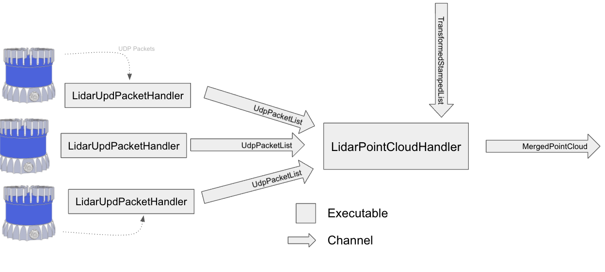
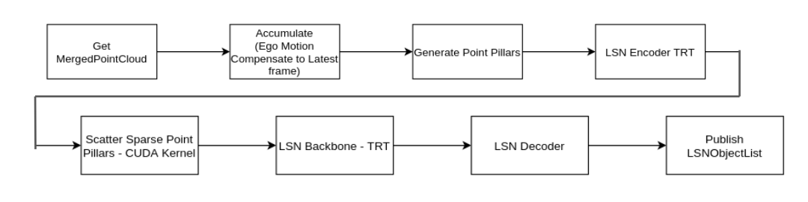
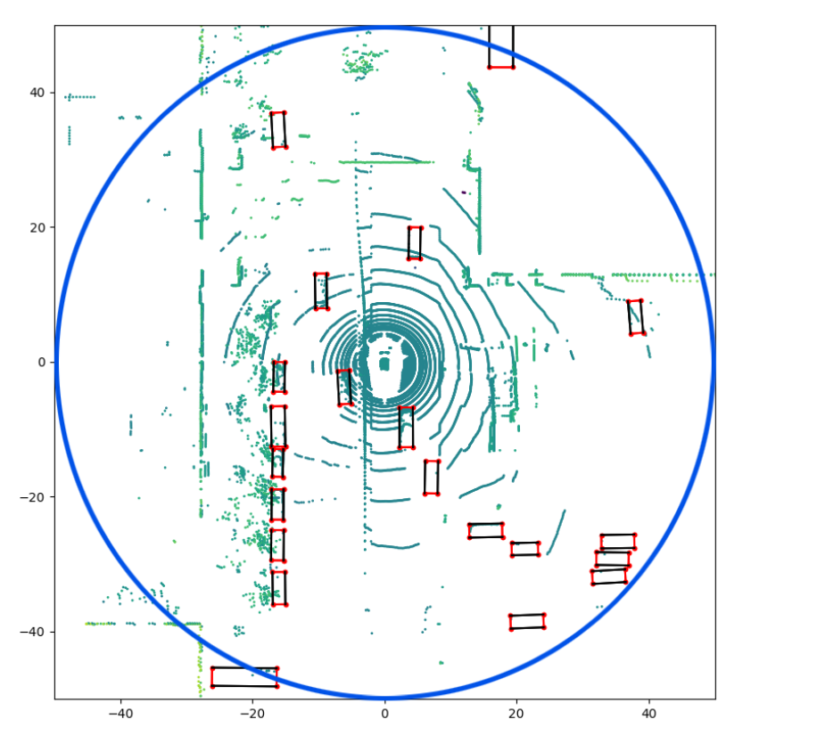
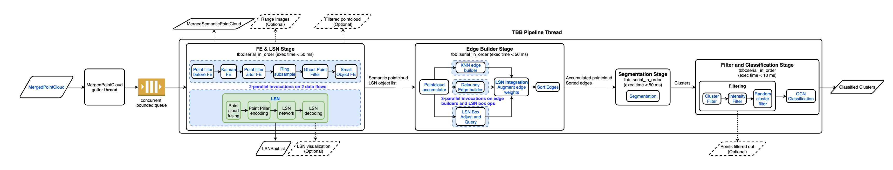
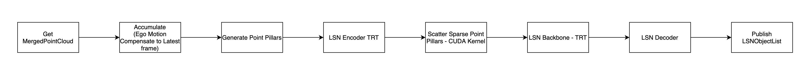
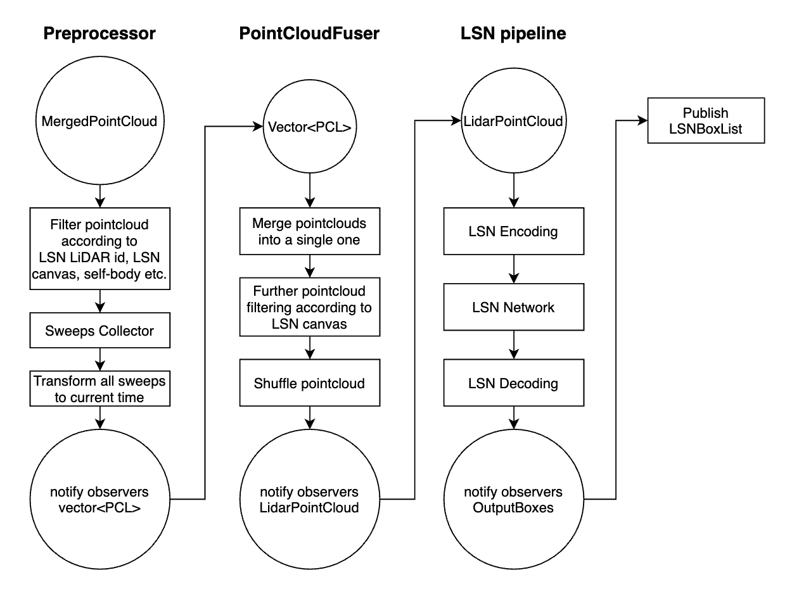

# Day 1 with Motional

Tasks: the
1. Onboard Training
2. Meet the group ppl
3. Set up the computer

## Perception and Prediction

### Overview

1. we build models to understand the world around us. 
2. Planning, and controls utilizes our understanding of the world to navigate to our goals. 
3. We research, train, and deploy machine learning (usually neural network aka deep learning) models. 

We are part of the Autonomous sensing & Services and work closely with Autonomy Platform and Autonomy Metrics teams to model the world. 

We are customers of **Localization** and suppliers to **Planning** and **Controls**. 

### Tenets 
1. we believe in thoroughly verifying our training and testing data. 
2. We believe that ML is best done by end-to-end parameters optimization from input to targets. 
3. We implement approppriate unit, regression, and integration tasks to ensure our models behave as expected during training and deployment. 

### Teams
1. Vision
2. Lidar
3. Prediction
4. Tracking

# Day 2 with Motional
Task: 
1. Meeting with Jien Cao
2. Group Meeting. 
3. Benefits Onboard meeting 1 - 2Pm
4. HRIS Onboarding Meeting. 
5. Prediction/Tracking Reading Group
6. Predict + Behavior Modeling Reading Group.

## Perception Workflow Tutorial

### Merged Point Cloud
Takes input from multiple Lidars and produces a single point cloud from an single sweep. 
1. Adjusts for device intrinsics
2. Transforms points to correct for pose changes during the sweep to base_link frame. 

Outputs: 
1. Fully transformed coords, x,y,z (base_link frame)
2. Intensity (Lidar defined)
3. Ring (Lowest to highest laser)
4. "Raw" azimuth corrected fir inttinsics
5. Timestamps for the camera sync. 

    

### Input and output channels

    

### Point Cloud Details

1. Lidars are synchronised and rotate at 20Hz
2. Sweep is clockwise as seen from above and arranged so that it always starts on the left to prevent gaps as the vehicle travels forwards. 

### Camera Sync

Azimuth offsets from the cameras are passed as configuration. 
Timestamps are published by calculating the timestamp as the lidar reached that azimuth. 

## LSN Pipeline

    

LSN wrapper design document
Lidar Semantic Network, is a deep neural network based model developed by machine learning team to enhance pointCloud based object detection of modelled objects (e.g., vehicle, cyclists and pedestrians). The model takes in N temporally consecutive merged pointcloud frames, creates "Point pillars" on a bird's view pseudo image canvas, and **Outputs detected object boxes within the radius circle** (shown with the blue circle in the figure below). For GEN1, 3 consecutive 5 Lidars merged pointcloud frames are used to deliver LSN coverage of 60 meter circle around the ego vehicle. 

    

The LSN wrapper module is developed to execute the LSN model efficiently in the perception Lidar pipeline. It receives the MergedPointCloud, performs filtering, accumulates the desired number of frames, creates the pointPillars and then feeds these PointPillars to the LSN network. The output of hte network is decoded into LSN Boxes which are used to improve the Lidar segmentation. 

LSN wrapper is one of the parallel invocations of the FE & LSN stage in GEN1 LiDAR pipeline, marked as green boxes in the following diagram.

    

### Input / outputs

**Inputs**
1. MergedPointCloud
2. TransformStampedList - SCS interface containing dynamic transforms from base_link frame to odom/map
3. Calibration file containing static transforms from Lidar position to base_link frame
4. Task Configuration. 

**Output**
1. LSNObjectList: Each box mainly contains the box description(position, dimension and heading), an associated class label, its confidence score, and velocities in X,Y,Z directions. 
? How to get the speed from group of points. 

### Requirements
1. Support all 5 GEN-1 LiDARs. 
2. Accumulate 3 merged point clouds. 
3. Filter the point cloud according to LSN range and map, distance to semantic prior. 
4. Call LSN
5. Decode output. 
6. Total Elapsed Time < 50 ms. 

    

### Data Flow

    

### Preprocessor
This step is responsible for filtering and aggregating multiple point clouds into a vector of pointcloud. 

**Input** LidarPointCloud.
**Output** vector<LidarPointCloud>
If a point fails in at least 1 filtering condition, it will be removed from the point cloud. 

