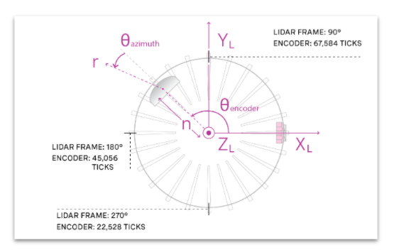
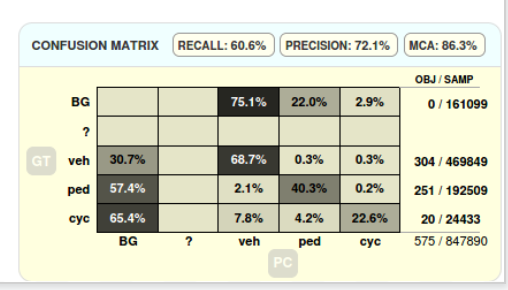

# Day 1 with Motional

Tasks: the
1. Onboard Training
2. Meet the group ppl
3. Set up the computer

## Perception and Prediction

### Overview

1. we build models to understand the world around us. 
2. Planning, and controls utilizes our understanding of the world to navigate to our goals. 
3. We research, train, and deploy machine learning (usually neural network aka deep learning) models. 

We are part of the Autonomous sensing & Services and work closely with Autonomy Platform and Autonomy Metrics teams to model the world. 

We are customers of **Localization** and suppliers to **Planning** and **Controls**. 

### Tenets 
1. we believe in thoroughly verifying our training and testing data. 
2. We believe that ML is best done by end-to-end parameters optimization from input to targets. 
3. We implement approppriate unit, regression, and integration tasks to ensure our models behave as expected during training and deployment. 

### Teams
1. Vision
2. Lidar
3. Prediction
4. Tracking
   

# Day 2 with Motional
Task: 
1. Meeting with Jien Cao
2. Group Meeting. 
3. Benefits Onboard meeting 1 - 2Pm
4. HRIS Onboarding Meeting. 
5. Prediction/Tracking Reading Group
6. Predict + Behavior Modeling Reading Group.

## Perception Workflow Tutorial

### Merged Point Cloud
Takes input from multiple Lidars and produces a single point cloud from an single sweep. 
1. Adjusts for device intrinsics
2. Transforms points to correct for pose changes during the sweep to base_link frame. 

Outputs: 
1. Fully transformed coords, x,y,z (base_link frame)
2. Intensity (Lidar defined)
3. Ring (Lowest to highest laser)
4. "Raw" azimuth corrected fir inttinsics
5. Timestamps for the camera sync. 

<p align = "center">    </p>

### Input and output channels

<p align = "center">    </p>

### Point Cloud Details

1. Lidars are synchronised and rotate at 20Hz
2. Sweep is clockwise as seen from above and arranged so that it always starts on the left to prevent gaps as the vehicle travels forwards. 

### Camera Sync

Azimuth offsets from the cameras are passed as configuration. 
Timestamps are published by calculating the timestamp as the lidar reached that azimuth. 

## LSN Pipeline

<p align = "center">    </p>

LSN wrapper design document
Lidar Semantic Network, is a deep neural network based model developed by machine learning team to enhance pointCloud based object detection of modelled objects (e.g., vehicle, cyclists and pedestrians). The model takes in N temporally consecutive merged pointcloud frames, creates "Point pillars" on a bird's view pseudo image canvas, and **Outputs detected object boxes within the radius circle** (shown with the blue circle in the figure below). For GEN1, 3 consecutive 5 Lidars merged pointcloud frames are used to deliver LSN coverage of 60 meter circle around the ego vehicle. 

<p align = "center">    </p>

The LSN wrapper module is developed to execute the LSN model efficiently in the perception Lidar pipeline. It receives the MergedPointCloud, performs filtering, accumulates the desired number of frames, creates the pointPillars and then feeds these PointPillars to the LSN network. The output of hte network is decoded into LSN Boxes which are used to improve the Lidar segmentation. 

LSN wrapper is one of the parallel invocations of the FE & LSN stage in GEN1 LiDAR pipeline, marked as green boxes in the following diagram.

<p align = "center">    </p>

### Input / outputs

**Inputs**
1. MergedPointCloud
2. TransformStampedList - SCS interface containing dynamic transforms from base_link frame to odom/map
3. Calibration file containing static transforms from Lidar position to base_link frame
4. Task Configuration. 

**Output**
1. LSNObjectList: Each box mainly contains the box description(position, dimension and heading), an associated class label, its confidence score, and velocities in X,Y,Z directions. 
? How to get the speed from group of points. 

### Requirements
1. Support all 5 GEN-1 LiDARs. 
2. Accumulate 3 merged point clouds. 
3. Filter the point cloud according to LSN range and map, distance to semantic prior. 
4. Call LSN
5. Decode output. 
6. Total Elapsed Time < 50 ms. 

<p align = "center">    </p>

### Data Flow

<p align = "center">    </p>
The task consists of 3 parts: 

1. Preprocessor 
2. PointCloud fuser
3. LSN pipeline


#### Preprocessor
This step is responsible for filtering and aggregating multiple point clouds into a vector of pointcloud. 

**Input** LidarPointCloud.
**Output** vector<LidarPointCloud>
If a point fails in at least 1 filtering condition, it will be removed from the point cloud. 

**Filters Check Conditions**
- ID : Verifies that a point has a proper LiDAR ID that with the set of LiDAR IDs required by LSN
- Coordinate : CHecks if an input point falls into the eligible coordinate boundaries. Two boundaries are checked here: 
  - a coarse LSN canvas boundary, which the radius is enlarged by "lsn_radius_range_extension" meters. The enlargement of pointcloud radius is to cater for the worst case ego motion at a later timestamp, so that the current filtered pointcloud will always have all the points in the LSN radius at that later time. 
  - self-body boundary where points fall onto the ego vehicle will be excluded. 
- Distance to the road boundary - checks if the points distance to road boundary is within the bound "off_road_filtering_threshold"

The coarsely filtered pointcloud pushed to SweepsCollector and then the latest N frames will be obtained and transformed to the latest pointcloud's timestamp. All the points after transformation will go through an additional file distance filtering step to conform to the exact LSN radius boundary. 

Finally, push the list of filtered and transformed pointcloud for further processing in the next stage. 

#### Point Cloud Fuser

**input**: vector<LidarPointCloud>
**Output** : LidarPointCloud
**Description** Receives a vector of point clouds and merges all of them in 1 point cloud, removes point that are too far away and shuffles the remaining points. 

Merge Pointclouds into a single one -> Further pointcloud filtering according to LSN canvas -> Shuffle pointcloud

#### LSN Pipeline

**input** LidarPointCloud 
**output** OutputBox
**Description** : The main work happens in this step. It runs data prepared with an encoder on GPU and returns results processed with a decoder.

##### Encoder
Converts a point cloud into a bird-eye view pseudo image. 
To achieve it the whole space is divided into fixed-sized bins. Encoder iterates over each point of a point cloud and constructs a pillar. There are limits for the maximum number of pillars and maximum number of point in each pillar. If anyone of these limits are exceeded the point is skipped. 

##### Lidar segmentation network
Transfer data to GPU memory and run the network. 

##### Decoder
Processed result and output it to further steps. 


### Computer Design 
The main control flow of LSN runs in 1 CPU thread, with several point level operation loops (eg, filtering, transformation, point pillar padding etc. ) parallelized with tbb::parallel_for. 
The LSN Encoder and Backbone networks are TensorRT plan files. This networks run on an Nvidia GPU. The plans are restricted to the major architecture of the GPU. A plan file for Pascal architecture cannot be used in Trining GPUs. 

The Scatter Sparse Point Pillars module is a CUDA kernel which runs on the GPU. 

# Day 3 with Motional

## Tracking and Fusion System 
### avTnF
TrackingFusionTask is the current tracker in perception pipeline
Tracks and fuses detections across multiple sensing modalities, including lidar pipeline, vision pipeline and radar pipeline.
1. EKF based filtering
2. Limited multi-hypothesis
3. PostProcessing including: 
   1. Re-id
   2. Track merging and re-initialization
   3. Semantic aided filtering. 
   4. GO splitting
4. Combined kinematic and attributes filtering

Tracking = Data Association + Filtering
p(z | track)
Filtering = Prediction + Likelihood "Bayesian'ed"

The kinematic state **x** can be augmented with a discrete state generically indexed by **i**. 
**i** :(objet type, motion model, color)
Network output is calibrated to be a probability mass function. 
However no uncertainty accompanying the measurement 
As our confusion matrices become more diagonally dominant the less benefit we get from modelling this uncertainty. 


<p align = "center">    </p>

<p align = "center">    </p>

### SimpleTracker
<p align = "center">    </p>

1. A baseline tracker for Gen2
2. Simplicity design principle
   1. No sophisticated filter or data association
   2. Rely on the accuracy of DL detection models
   3. Only add complexity when needed. 
3. Class segregated data association (JVC), currently on multi-hypothesis
4. EKF based filtering
   1. Both measurement and estimation space are the same, 11 - dim
      1. x, y, z heading, L, W, H, score, Vx, Vy, Vz (basically what LSN provides)
      2. Constant-velocity motion model (no turning constrains)
**SimpleTracker Architecture Summary**

## Development Workflow

PR Process
- create PRs only when ready to review, otherwise experimental branches
- Branch rebased on perception/develop
  - Please follow develop guidelines
- Test results are required to justify the merge: 
  - Offline test; VATs(GT) required on almost all changes. No regression is generally encored
  - Vehicle test (DT): required as long as the changes touch the code running on car, even if you are certain it's NOOP. 
- At least 2 approvals, at least one from the code owner. 
- Merge by one of the repo owners. 

## Development Guidelines
The page is [Development Guidelines](https://confluence.ci.motional.com/confluence/display/PER/Development+Guidelines)
Company 
[Daniele's Guide](https://confluence.ci.motional.com/confluence/display/PLAN/Coding+Recommendations)

TODO: finish reading the development guide later

## GT Regression
[GT regression Documentation](https://confluence.ci.motional.com/confluence/display/PER/GT+Regression+Documentation)
GT regression refers to our **Code** and **infrastructure** for evaluating performance of the perception of the perception system on prerecorded annotated logs of sensor data from the car.

While the code can be run locally, mostly it's run on [VATS](https://vats.nutonomy.com/), which is basically an integrated job runner and results visualization tool. 

<p align = "center">    </p>

Jenkins : Build grate things at any scale. An open source automation sever which enables developers to reliable build, test, and deploy their software. 

av-stack and its Jenkins job producer docker images containing all the code run on the car. We call these builds. 
Perception-regression-tests and its jenkins job bundle together a build with playback and evaluation code into docker images that can be selected through the VATS UI, and executed on a selection of scenarios. 

## DT Vehicle test (development Test)
A test to run the perception branch on the car to ensure nothing is broken end-to-end on the av-stack side. 

## SimpleTracker architecture summary

### Assumptions
1. Class-segregated tracking, i.e. Currently no cross association between vehicle/pedestrian/bicyclist tracks and measurements. 
2. GO not in scope. 
3. LSN object (<60m) is the only type of input. 
4. Everything runs single threaded. 

<p align = "center">    </p>

### Issues
1. [Tech Debt](https://confluence.ci.motional.com/confluence/display/PER/Tech+Debt) page.
2. Occasional moving vehicle orientation flickering (usually by 180deg for 1~2 frames)
3. The conf score from LSN has big fluctuation on some trucks (0.3 - 0.9) but our tracking smoothed it out. 
   
### Wish list
1. Integrated with LSN embedding output. 
2. Integrate with LSN theta_dot output or any other high-order states. 
3. Contract checker. Make sure the tracker output is sane: within a reasonable radius around ego vehicle. L/W/H confidence value are positive and reasonable. Heading not too far off from velocity direction is not static. 

## Tech Debt

### Only publishing empty OcclusionInfo message : Do not know what is this. 
PLAN still requires at least empty occ message to be published to pass their message freshness check periodically, Currently we are publishing empty ones in executive()

### Oversimplified CV model
Next step can try CTRV by adding turn rate in motion model ad even CTRV_nonholo for both vehicle and Cyclic. 

### Coercing LSN heading to velocity direction for moving peds. 
in LSNhandler, we use below function. 
```cpp
double computeAdjustedHeading(const double heading, const Eigen::Vector3d globalVel, const ObjectType type)
```
To adjust pedestrian heading measurement from LSN. 
We currently don't trust the heading measurement from LSN, although velocity seems OK. 
For static ped, i.e. small velocity, we fall back to the LSN heading value.  

### No inter-class NMS
LSN teams confirms no inter-class NMS is done in LSN. Hence, it's not unusual to see a ped on top if a cyc, or a cyc on top of a veh. 
In the future tracker needs to handle such obvious spurious overlap detection cases. 

### Confidence score not used
One advantage about SimpleTracker is that it also tracks the raw confidence score published by LSN. However, the score currently is not used internally in tracker. We can consider: 
1. Incorporate the tracked confidence value track confirmation/unconfirmation, how do we decay the confidence value of a coasting/unassociated track? 
2. Track birth optimization. Use meas confidence value or any other feature? 

### Revisit initial covariance matrix when birthing
Currently when birthing a track, we just copied the measurement covariance, mostly because both space happen to be the same. 
Is it the best way? 

### Bona fide 3D tracking

Currently although we have Z and Vz in both observation and estimation space, in below 2 place we ignore Z direction: 
1. nominal Process noise for Z and Vz, basically DWNA model in 2D top down view. 
2. Data association for ped (and Cyc) is based on 2D xy L2 distance. 

### No multiple hypothesis, class segregated tracking
Allow class switching between pedestrian and bicyclist. 


## Paid off

### Wrap heading between -M_PI_2, M_PI
- In the update function, the heading wrap around into [-pi/2, pi/2], which assumes heading is indistinguishable mod 180 (AB3DMOT paper also uses this trick). 
- That assumption applies to L-shape from Lidar pipeline, but not LSN. 
- I found the issue as I saw some moon-walking peds in the logs. 
- Vehicle heading is also further improved by the fix. 
  
### Rotating stopped Vehicle. 
Due to 180 heading ambiguity from LSN, and tracker tries to smooth out the large heading error. 

### Need to add tracker level unit test
Currently almost every module in tracker and all the utils have good test coverage, except the SimpleTracker class itself. 

### src/module/simple_tracker has dependency on middleware
According to Perception's Development Guidelines, module must no have dependency on middleware. We need to push publisher, LSN handler and bridge converter to task. 


# Tracklet Stitcher Python Prototype
[doc](https://confluence.ci.motional.com/confluence/display/PER/Tracklet+Stitcher+Python+Prototype)


# Ideas

## Uncertainty Aware EKF.
use the uncertainty Aware EKF to learn the uncertainty. And use the MHT for the heading. 

## Class agnostic Tracking
1. output from LSN is just the object. 
2. Universal motional model. 

## Uncertainty Training
use the uncertainty net for the Lidar Object detection part.

## Tracking by detection, detection to tracking
This will be investigated later. 

