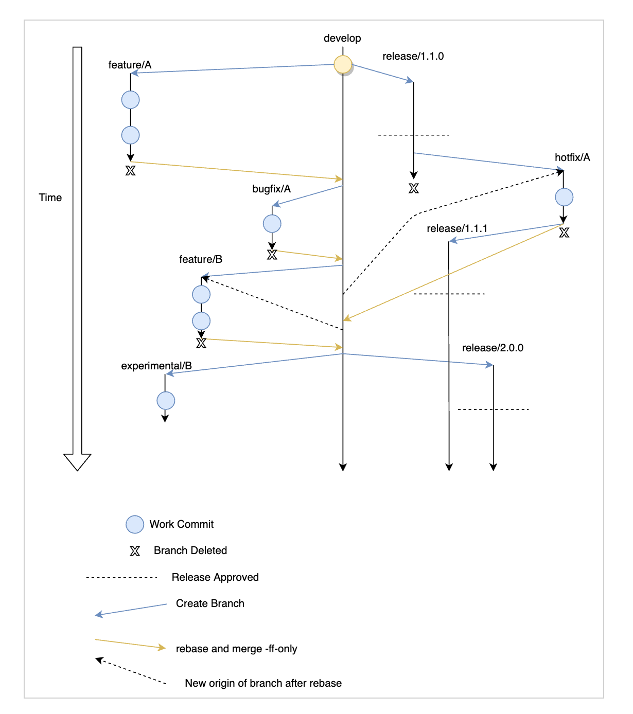

# Development Workflow

[link](https://confluence.ci.motional.com/confluence/display/PER/Development+Workflow)

    

1. we will further commit to the rebase based workflow. 
2. We will differentiate **feature** branches and **bugfix** branches. 
3. **develop** branch will be our default mainline branch. 

The following are the types of branches that will exist : 

1. **develop**  - The "development" branch which contains the most up-to-date reviewed and tested code. All feature and bugfix PRs branch off and targe here. 
2. **feature** feature/PERC-####/brief-description-of-feature Contains new feature development they branch off **develop** and merge back to **develop**. 
3. **release** branches, release / #.#.#-#.#.# is the semantic version of the release. Used to create and maintain release. 
4. **hotfix** branches - hotfix/PERC-####/brief-description-of-hotfix contains hotfixes to current supported release. 
5. **experimental** branches : experimental/brief-description-of-branch Contains experimental features of testing and not meant for release. 

## Commit template
1. All commits in **feature/bugfix/hotfix** branches must follow the template - **JIRA Issue : Type: brief description of commit(more than 20 characters)**. 
   1. Jira issue must match the issue in the branch. 
   2. Type should be one of **feature/bugfix/hotfix**
   3. It will help automatically generate Release Note, if we follow this. 
2. To avoid boiler-plate, there is a pre-commit-msg hook which automatically populates the jira issue Type based on branch name to the commit message. 
   1. To trigger it make the commit using 'git commit'
   2. Do not use the 'git commit -m ""' option
   3. The hook is not triggered for merge commits during rebase. 

## Feature Development
1. For **major features** - create a design document in confluence first. 
   1. For **minor features** - document the changes made, expected behavior change in car, what to test for in the **PR description**
2. All **feature** branches must have an associated Jira ticket. This cannot be the default PERC-0000 or PERC-9999 or something like that. It has to be a valid Jira ticket.
   1. **feature** branches will be named as follows - **feature/PERC-####/brief-description-of-branch**
   2. Branches not following the naming convention will be deleted from remote.
3. Feature branches will branch off develop.
   1. Every so often (every day) rebase your branch on top of **develop**. 
   2. During this rebase, squash commits of the form
      1. addressed review comments
      2. Fix typos
      3. Code formatting
      4. Minor Fixes
      5. Minor changes
      6. etc.....
   3. **DO NOT MERGE DEVELOP into your branch**
4. After a feature is ready, create a PR from the feature branch to **develop** branch. Do not create PRs for features that are not ready to review. PR description should contain - 
   1. a link to the design document (if it exists)
   2. A brief description of what changed, why it changed
   3. A link to any DT or GT that was conducted
   4. The expected change in the behavior of the car
   5. The test procedure or update to test procedure to test for the change in the PR (can be empty for minor changes)
   6. Move the Jira ticket to  In Review stage.
   7. Please run ctest locally  to ensure all current tests still pass. GPU tests do not run on Jenkins.
5. CODEOWNERS will be automatically added to the PR as reviewers
   1. Add anyone else who you think is a relevant person to review the PRs.
   2. Do not add anyone who is irrelevant to the PR as a reviewer just to get approvals.
6. A PR will require 2 approvals (1 codeowner + 1 any other approval). To get the approvals -
   1. address all comments
   2. perform necessary testing - DT + GT or GT only
   3. there should be no pending tasks
   4. Jenkins build should succeed.
7. After a PR is ready to merge, contact one of the people with the merge powers to click the merge button
   1. The people with merge powers act as a gatekeeper and ensure that the PR description contains all the stuff it should contain.
   2. This is to ensure that the release notes can be generated properly
   3. Merge will be performed as `git merge --ff-oly`. So a merge commit will never be created.
8. Once the branch is merged, the Jira ticket is moved to done and the branch is deleted.

## Other Guideline
1. Do not create PRs for Jenkins builds. A PR is only created when it is ready for review.
2. If during the course of the review, it is decided that major design changes are required then decline the PR (not delete) and then re-open it once it is ready again (if you continue using the old branch).
3. Any feature branch which has not had a new commit for 30 days will be marked for deletion.
   1. The last committer will be contacted regarding the status of the branch before deletion.
   
