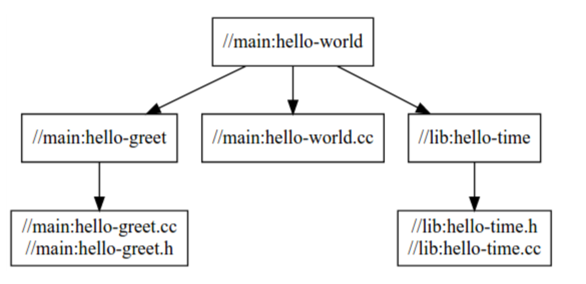

# Bazel tutorial : build a C++ Project

- [Bazel tutorial : build a C++ Project](#bazel-tutorial--build-a-c-project)
  - [Build with Bazel](#build-with-bazel)
    - [Set up tje workspace](#set-up-tje-workspace)
    - [Understand the BUILD file](#understand-the-build-file)
    - [Refine your Bazel build](#refine-your-bazel-build)
      - [Specify multiple build targets](#specify-multiple-build-targets)
    - [Use multiple packages](#use-multiple-packages)
  - [cc_library](#cc_library)
    - [Header inclusion checking](#header-inclusion-checking)

[link](https://docs.bazel.build/versions/main/tutorial/cpp.html) 

```
examples
└── cpp-tutorial
    ├──stage1
    │  ├── main
    │  │   ├── BUILD
    │  │   └── hello-world.cc
    │  └── WORKSPACE
    ├──stage2
    │  ├── main
    │  │   ├── BUILD
    │  │   ├── hello-world.cc
    │  │   ├── hello-greet.cc
    │  │   └── hello-greet.h
    │  └── WORKSPACE
    └──stage3
       ├── main
       │   ├── BUILD
       │   ├── hello-world.cc
       │   ├── hello-greet.cc
       │   └── hello-greet.h
       ├── lib
       │   ├── BUILD
       │   ├── hello-time.cc
       │   └── hello-time.h
       └── WORKSPACE
```
There are three sets of files, each set representing a stage. 
1. the first stage, you will build a single target residing in a single package. 
2. the second stage, you will split your project into multiple targets but keep it in a single package. 
3. the third stage. you will split your project into multiple packages and build it with multiple targets. 

## Build with Bazel

### Set up tje workspace

Before you can build a project, you need to set up its **workspace**. A workspace is a directory that holds your project's source files and Bazel's build outputs. It also contains files thant Bazel recognizes as special: 

- The **WORKSPACE** file, which identifies the directory and its contents as a Bazel workspace and lives at the root of the project's directory structure. 
- One or more **BUILD** files, which tell Bazel how to build different parts of the project. (A directory within the workspace that contains a **BUILD** file is a package)
  
To designate a directory as a Bazel workspace, create an empty file named **WORKSPACE** in that directory. 
When Bazel builds the project, all inputs and dependencies must be in the same workspace.

### Understand the BUILD file

A **BUILD** file contains several different types of instruction for Bazel. 
The most important type is the *build rule*, which tells Bazel how to build the desired outputs, such as executable binaries of libraries. Each instance of a build rule in the **BUILD** file is called *target* and points to specific set of source files and dependencies. A target can also point to other targets. 
For example
```
cc_binary(
    name = "hello-world",
    srcs = ["hello-world.cc"],
)
```
The **hello-world** target instantiates Bazel's build-in **bb-binary** rule. The rule tells Bazel to build a self-contained executable binary from the `helo-world.cc` source file with no dependencies. 

### Refine your Bazel build

While a single target is sufficient for small projects, you may want to split larger projects into multiple targets and packages to allow for fast incremental builds (that is, only rebuild what's changed) and to speed up your builds by building multiple parts of a project at once. 

#### Specify multiple build targets

```cpp
cc_library(
    name = "hello-greet",
    srcs = ["hello-greet.cc"],
    hdrs = ["hello-greet.h"],
)

cc_binary(
    name = "hello-world",
    srcs = ["hello-world.cc"],
    deps = [
        ":hello-greet",
    ],
)
```
With this **BUILD** file, Bazel first builds the `hello-greet` library (using Bazel's build-in `cc_library` rule), then the `hello-world` binary. The `deps` attribute in the `hello-world` target tells Bazel that the `hello-greet` library is required to build the `hello-world` binary. 

### Use multiple packages
You can split the project into multiple packages. 
```
└──stage3
   ├── main
   │   ├── BUILD
   │   ├── hello-world.cc
   │   ├── hello-greet.cc
   │   └── hello-greet.h
   ├── lib
   │   ├── BUILD
   │   ├── hello-time.cc
   │   └── hello-time.h
   └── WORKSPACE
```
Now there are two sub-directories, and each contains a **BUILD** file. Therefore, to Bazel, the workspace now contains two packages, `lib` and `main`. 

in the `lib/BUILD` file

```cpp
cc_library(
    name = "hello-time",
    srcs = ["hello-time.cc"],
    hdrs = ["hello-time.h"],
    visibility = ["//main:__pkg__"],
)

```

and at the `main/BUILD` file: 
```cpp
cc_library(
    name = "hello-greet",
    srcs = ["hello-greet.cc"],
    hdrs = ["hello-greet.h"],
)

cc_binary(
    name = "hello-world",
    srcs = ["hello-world.cc"],
    deps = [
        ":hello-greet",
        "//lib:hello-time",
    ],
)
```
As you can see, the hello-world target in the main package depends on the hello-time target in the lib package (hence the target label //lib:hello-time) - Bazel knows this through the deps attribute. Take a look at the dependency graph:
<p align = "center">    </p>

Notice that for the build to succeed, you make the `//lib:hello-time` target in `lib/BUILD` explicitly visible to targets in `main/BUILD` using the `visibility` attribute. 


## cc_library
```cpp
cc_library(name, deps, srcs, data, hdrs, alwayslink, compatible_with, copts, defines, deprecation, distribs, exec_compatible_with, exec_properties, features, implementation_deps, include_prefix, includes, licenses, linkopts, linkstamp, linkstatic, local_defines, nocopts, restricted_to, strip_include_prefix, tags, target_compatible_with, testonly, textual_hdrs, toolchains, visibility, win_def_file)
```
### Header inclusion checking

All header files that are used in the build must be declared in the `hdrs`. 

- `name` : required, a unique name for this target. 
- `deps` : List of labels. The list of other libraries to be linked in to the binary target. These can be `cc_library` or `objc_library` targets. 
- `src` : List of labels; The list of C and C++ files that are processed to create the target. These are C/C++ source and header files, either non-generated (normal source code) or generated.
- `hdrs` : List of labels. The list of header files published by this library to be directly included by sources in dependent rules. This is the strongly preferred location for declaring header files that describe the interface for the library. 
- `strip_include_prefix`: The prefix to strip from the paths of the headers of this rule. When set, the headers in the `hdrs` attribute of this rule are accessible at their path with this prefix cut off. 