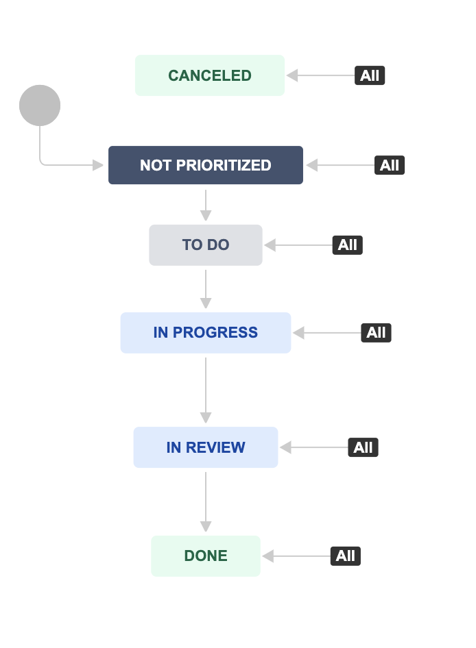

# Jira Learning

Jira tracks issues, which can be bugs, feature requests, or any other tasks you want to track. 

Each issue has a variety of associated information including: 
1. the issue type. 
2. a summary
3. a description. 
4. the project which the issue belongs to. 
5. Components within a project which are associated with this issue. 
6. versions of the project which will resolve the issue. 
7. a priority for being fixed. 
8. an assigned developer to work on the task. 
9. a reporter - the user who entered the issue into the system. 
10. the current status of the issue. 
11. a full history log of all field changes that have occurred. 
12. a comment trail added by users. 
13. if the issue is resolved - the resolution. 

## Issue Types

Jira can be sued to track many different types of issues. The currently

1. Task : A task that needs to be done. 
2. Bug : A problem which impairs prevents the functions of the products. 
3. Epic : Issue type for a big user story that needs to be broken. 
4. Story : Issue type for a user story. 

## Priority Levels
An issue has a priority level which indicates its importance. The currently defined priorities are list below: 
1. Blocker : this is a blocker. 
2. Critical : This problem will block the progress. 
3. High : Serious problem that could block progress. 
4. Medium: Has the potential to affect progress. 
5. Low : Minor problem or easily worked around. 

## Statuses
Helps identify where an issue is in its lifecycle. 
Issues move from **TO DO** to **In progress** when work starts on them, and later move to **Done** when all work is complete. 

    

 **Canceled** 
       |
       |
      \|/
 **Not Prioritized** <--- **Enter**
       |
       |
      \|/
    **TO DO**
       |
       |
      \|/
**In Progress**
       |
       |
      \|/
**In Review**
       |
       |
      \|/
   **Done**