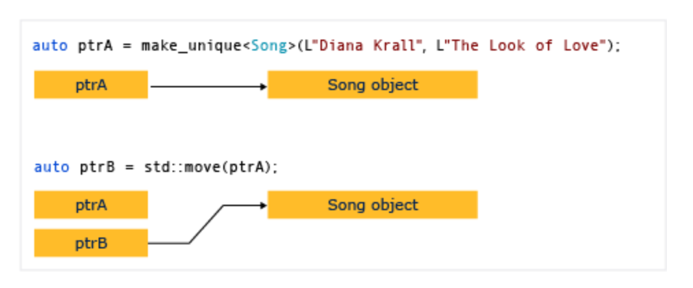

# Smart Pointers 

- [Smart Pointers](#smart-pointers)
  - [Uses for smart pointers](#uses-for-smart-pointers)
  - [2. Kinds of Smart Pointers](#2-kinds-of-smart-pointers)
    - [C++ Standard Library smart pointers](#c-standard-library-smart-pointers)
  - [How to Create and use `unique_ptr` instances.](#how-to-create-and-use-unique_ptr-instances)
    - [Example 1](#example-1)
    - [Example 2](#example-2)
    - [Example 3](#example-3)
    - [Example 4](#example-4)
  - [How to: Create and Use shared_ptr instances](#how-to-create-and-use-shared_ptr-instances)
    - [Example setup](#example-setup)
    - [Example 1](#example-1-1)
    - [Example 2](#example-2-1)
    - [Example 3](#example-3-1)
    - [Example 4](#example-4-1)
    - [Example 5](#example-5)

In this article [link](https://docs.microsoft.com/en-us/cpp/cpp/smart-pointers-modern-cpp?view=msvc-160) 
1. Uses for smart pointers
2. Kinds of smart pointers

In modern C++ programming, the standard Library includes `smart pointers`, which are used to help ensure that programs are free of memory and resource leaks and are exception-free. 

## Uses for smart pointers

Smart pointers are defined in the `std` namespace in the <memory> header file. They ar crucial to the RAII idiom. The goal of this idiom is to ensure that resource acquisition occurs ar the same time that the object is initialized, so that all resources for the object are created and made ready in one line of code. In practical terms, the main principle of RAII is to give ownership of any heap-allocated resource. 

**Important** Always create smart pointers on a separate line of code, never in a parameter list, so that a subtle resource leak won't occur due to certain parameter list allocation rules. 

```cpp
class LargeObject
{
public:
    void DoSomething(){}
};

void ProcessLargeObject(const LargeObject& lo){}
void SmartPointerDemo()
{    
    // Create the object and pass it to a smart pointer
    std::unique_ptr<LargeObject> pLarge(new LargeObject());

    //Call a method on the object
    pLarge->DoSomething();

    // Pass a reference to a method.
    ProcessLargeObject(*pLarge);

} //pLarge is deleted automatically when function block goes out of scope.
```

Essential steps for using smart pointers. 
1. Declare the smart pointers are an automatic variable. (Do not use the `new` or `malloc` expression on the smart pointer itself. )
2. In the type parameter, specify the pointed-to type of the encapsulated pointer. 
3. Pass a raw pointer to a `new`-ed object in the smart pointer constructor. 
4. Use the overloaded `->` and `*` operators to access the object. 
5. Let the smart pointer delete the object. 

Smart pointers are designed to be as efficient as possible both in terms of memory and performance. For example, the only data member in `unique_ptr` is the encapsulated pointer. This means that `unique_ptr` is exactly the same size of that pointer. 

Smart pointers have their own member functions, which are accessed by using "dot" notation. For example, some C++ Standard Library smart pointers have a reset member function that releases ownership of the pointer. This is useful when you want to free the memory owned by the smart pointer before the smart pointer goes out of scope, as shown in the following example.

```cpp
void SmartPointerDemo2()
{
    // Create the object and pass it to a smart pointer
    std::unique_ptr<LargeObject> pLarge(new LargeObject());

    //Call a method on the object
    pLarge->DoSomething();

    // Free the memory before we exit function block.
    pLarge.reset();

    // Do some other work...

}
```
Smart pointers usually provide a way to access their raw pointer directly. `get` member function for this purpose. 
pass the raw pointer to the code that does not support smart pointers. 

```cpp
void SmartPointerDemo4()
{
    // Create the object and pass it to a smart pointer
    std::unique_ptr<LargeObject> pLarge(new LargeObject());

    //Call a method on the object
    pLarge->DoSomething();

    // Pass raw pointer to a legacy API
    LegacyLargeObjectFunction(pLarge.get());    
}
```

## 2. Kinds of Smart Pointers

### C++ Standard Library smart pointers
Use these smart pointers are a first choice for encapsulating pointers to plain old c++ objects (POCO). 

`unique_ptr` 
Allows exactly one owner of the underlying pointer. Use as the default choice for POCO unless you know for certain that you require a `shared_ptr`. Can be moved to a new owner, but not copied or shared. 

`shared_ptr`
Reference counted smart pointer. Use when you want to assign one raw pointer to multiple owners. When you return a copy of pointer from a container but want to keep the original. The raw pointer is not deleted until all `shared_ptr` owners have gone our of scope or have otherwise given up ownership. The size is two pointers, one for the object and one for the shared control block that contains the reference count.  

## How to Create and use `unique_ptr` instances. 

A `unique_ptr` does not share its pointer. It cannot be copied to another `unique_ptr`, passed by value to a function, or used in any c++ STL that requires copies to be made. A `unique_ptr` can only be moved. This means that the ownership of the memory resource is transferred to another `unique_ptr` and the original `unique_ptr` no longer owns it. We recommend that you restrict an object to one owner, because multiple ownership adds complexity to the program logic. Therefor, when you need a smart pointer for a plain C++ object, use `unique_ptr`, and when you construct a `unique_ptr`, use the `make_unique` helper function. 

<p align = "center">    </p>

### Example 1
The following example shows how to create `unique_ptr` instances and pass them between functions.

```cpp
unique_ptr<Song> SongFactory(const std::wstring& artist, 
                             const std::wstring& title)
{
    // Implicit move operation into the variable that stores the result.
    return make_unique<Song>(artist, title);
}

void MakeSongs()
{
    // Create a new unique_ptr with a new object.
    auto song = make_unique<Song>(L"Mr. Children", L"Namonaki Uta");

    // Use the unique_ptr.
    vector<wstring> titles = { song->title };

    // Move raw pointer from one unique_ptr to another.
    unique_ptr<Song> song2 = std::move(song);

    // Obtain unique_ptr from function that returns by value.
    auto song3 = SongFactory(L"Michael Jackson", L"Beat It");
}
```
It can be moved, but not copied. "Moving" transfers ownership to a new `unique_ptr` and resets the old `unique_ptr`.

### Example 2 
The following example shows how to create unique_ptr instances and use them in a vector.

```cpp
void SongVector()
{
    vector<unique_ptr<Song>> songs;
    
    // Create a few new unique_ptr<Song> instances
    // and add them to vector using implicit move semantics.
    songs.push_back(make_unique<Song>(L"B'z", L"Juice")); 
    songs.push_back(make_unique<Song>(L"Namie Amuro", L"Funky Town")); 
    songs.push_back(make_unique<Song>(L"Kome Kome Club", L"Kimi ga Iru Dake de")); 
    songs.push_back(make_unique<Song>(L"Ayumi Hamasaki", L"Poker Face"));

    // Pass by const reference when possible to avoid copying.
    for (const auto& song : songs)
    {
        cout << L"Artist: " << song->artist << L"   Title: " << song->title << endl; 
    }    
}
```

In the range for loop, notice that the `unique_ptr` is passed by reference. If you try to pass by value here, the compiler will throw an error because the `unique_ptr` copy constructor is deleted. 

### Example 3
The following example shows how to initialize the `unique_ptr` that is a class member. 

```cpp
class MyClass
{
private:
    // MyClass owns the unique_ptr.
    unique_ptr<ClassFactory> factory;
public:

    // Initialize by using make_unique with ClassFactory default constructor.
    MyClass() : factory (make_unique<ClassFactory>())
    {
    }

    void MakeClass()
    {
        factory->DoSomething();
    }
};
```

### Example 4 
You can use `make_unique` to create a `unique_ptr` to an array, but you cannot use `make_unique` to initialize the array element. 

```cpp
// Create a unique_ptr to an array of 5 integers.
auto p = make_unique<int[]>(5);

// Initialize the array.
for (int i = 0; i < 5; ++i)
{
    p[i] = i;
    wcout << p[i] << endl;
}
```

## How to: Create and Use shared_ptr instances
[link](https://docs.microsoft.com/en-us/cpp/cpp/how-to-create-and-use-shared-ptr-instances?view=msvc-160)

More than one owner might have to manage the lifetime of the object in memory. After you initialize a `shared_ptr` you can copy it, pass it by value in function arguments, and assign it to other `shared_ptr` instances. 

### Example setup

```cpp
// shared_ptr-examples.cpp
// The following examples assume these declarations:
#include <algorithm>
#include <iostream>
#include <memory>
#include <string>
#include <vector>

struct MediaAsset
{
    virtual ~MediaAsset() = default; // make it polymorphic
};

struct Song : public MediaAsset
{
    std::wstring artist;
    std::wstring title;
    Song(const std::wstring& artist_, const std::wstring& title_) :
        artist{ artist_ }, title{ title_ } {}
};

struct Photo : public MediaAsset
{
    std::wstring date;
    std::wstring location;
    std::wstring subject;
    Photo(
        const std::wstring& date_,
        const std::wstring& location_,
        const std::wstring& subject_) :
        date{ date_ }, location{ location_ }, subject{ subject_ } {}
};

using namespace std;

int main()
{
    // The examples go here, in order:
    // Example 1
    // Example 2
    // Example 3
    // Example 4
    // Example 6
}
```

### Example 1

Whenever possible, use the `make_shared` function to create a `shared_ptr` when the memory resource is created for the first time. `make_shared` is exception-safe. It uses the same call to allocate the memory for the control block and the resource, which reduces the construction overhead. If you don't use `make_shared` then you have to use an explicit `new` expression to create the object before you pass it to the `shared_ptr` constructor.  The following example shows various ways to declare and initialize a `shared_ptr` together with a new object.

```cpp
// Use make_shared function when possible.
auto sp1 = make_shared<Song>(L"The Beatles", L"Im Happy Just to Dance With You");

// Ok, but slightly less efficient. 
// Note: Using new expression as constructor argument
// creates no named variable for other code to access.
shared_ptr<Song> sp2(new Song(L"Lady Gaga", L"Just Dance"));

// When initialization must be separate from declaration, e.g. class members, 
// initialize with nullptr to make your programming intent explicit.
shared_ptr<Song> sp5(nullptr);
//Equivalent to: shared_ptr<Song> sp5;
//...
sp5 = make_shared<Song>(L"Elton John", L"I'm Still Standing");

```

### Example 2
The following example shows how to declare and initialized `shared_ptr` instances that take on shared ownership of an object that has already been allocated by another `shared_ptr`, Assumed that `ps2` is an initialized `shared_ptr`. 

```cpp
//Initialize with copy constructor. Increments ref count.
auto sp3(sp2);

//Initialize via assignment. Increments ref count.
auto sp4 = sp2;

//Initialize with nullptr. sp7 is empty.
shared_ptr<Song> sp7(nullptr);

// Initialize with another shared_ptr. sp1 and sp2
// swap pointers as well as ref counts.
sp1.swap(sp2);

```

### Example 3 
shared_ptr is also helpful in C++ Standard Library containers when you're using algorithms that copy elements. You can wrap elements in a shared_ptr, and then copy it into other containers with the understanding that the underlying memory is valid as long as you need it, and no longer. The following example shows how to use the remove_copy_if algorithm on shared_ptr instances in a vector.

```cpp
vector<shared_ptr<Song>> v {
  make_shared<Song>(L"Bob Dylan", L"The Times They Are A Changing"),
  make_shared<Song>(L"Aretha Franklin", L"Bridge Over Troubled Water"),
  make_shared<Song>(L"Thalía", L"Entre El Mar y Una Estrella")
};

vector<shared_ptr<Song>> v2;
remove_copy_if(v.begin(), v.end(), back_inserter(v2), [] (shared_ptr<Song> s) 
{
    return s->artist.compare(L"Bob Dylan") == 0;
});

for (const auto& s : v2)
{
    wcout << s->artist << L":" << s->title << endl;
}
```

### Example 4 
You can use dynamic_pointer_cast, static_pointer_cast, and const_pointer_cast to cast a shared_ptr. These functions resemble the dynamic_cast, static_cast, and const_cast operators. The following example shows how to test the derived type of each element in a vector of shared_ptr of base classes, and then copy the elements and display information about them. 

```cpp
vector<shared_ptr<MediaAsset>> assets {
  make_shared<Song>(L"Himesh Reshammiya", L"Tera Surroor"),
  make_shared<Song>(L"Penaz Masani", L"Tu Dil De De"),
  make_shared<Photo>(L"2011-04-06", L"Redmond, WA", L"Soccer field at Microsoft.")
};

vector<shared_ptr<MediaAsset>> photos;

copy_if(assets.begin(), assets.end(), back_inserter(photos), [] (shared_ptr<MediaAsset> p) -> bool
{
    // Use dynamic_pointer_cast to test whether
    // element is a shared_ptr<Photo>.
    shared_ptr<Photo> temp = dynamic_pointer_cast<Photo>(p);
    return temp.get() != nullptr;
});

for (const auto&  p : photos)
{
    // We know that the photos vector contains only 
    // shared_ptr<Photo> objects, so use static_cast.
    wcout << "Photo location: " << (static_pointer_cast<Photo>(p))->location << endl;
}
```

### Example 5

TODO: read the following content. 
You can pass a shared_ptr to another function in the following ways:
1. Pass the `shared_ptr` by value. This invokes the copy constructor, increments the reference count, and makes the callee an owner. There's a small amount of overhead in this operation, which may be significant depending on how many shared_ptr objects you're passing. Use this option when the implied or explicit code contract between the caller and callee requires that the callee be an owner.
2. Pass the `shared_ptr` by reference or const reference. In this case, the reference count isn't incremented, and the callee can access the pointer as long as the caller doesn't go out of scope. Or, the callee can decide to create a shared_ptr based on the reference, and become a shared owner. Use this option when the caller has no knowledge of the callee, or when you must pass a shared_ptr and want to avoid the copy operation for performance reasons.
3. Pass the underlying pointer or a reference to the underlying object. This enables the callee to use the object, but doesn't enable it to share ownership or extend the lifetime. If the callee creates a shared_ptr from the raw pointer, the new shared_ptr is independent from the original, and doesn't control the underlying resource. Use this option when the contract between the caller and callee clearly specifies that the caller retains ownership of the shared_ptr lifetime.
4. When you're deciding how to pass a shared_ptr, determine whether the callee has to share ownership of the underlying resource. An "owner" is an object or function that can keep the underlying resource alive for as long as it needs it. If the caller has to guarantee that the callee can extend the life of the pointer beyond its (the function's) lifetime, use the first option. If you don't care whether the callee extends the lifetime, then pass by reference and let the callee copy it or not.
5. If you have to give a helper function access to the underlying pointer, and you know that the helper function will just use the pointer and return before the calling function returns, then that function doesn't have to share ownership of the underlying pointer. It just has to access the pointer within the lifetime of the caller's shared_ptr. In this case, it's safe to pass the shared_ptr by reference, or pass the raw pointer or a reference to the underlying object. Passing this way provides a small performance benefit, and may also help you express your programming intent.
6. Sometimes, for example in a std::vector<shared_ptr<T>>, you may have to pass each shared_ptr to a lambda expression body or named function object. If the lambda or function doesn't store the pointer, then pass the shared_ptr by reference to avoid invoking the copy constructor for each element.

