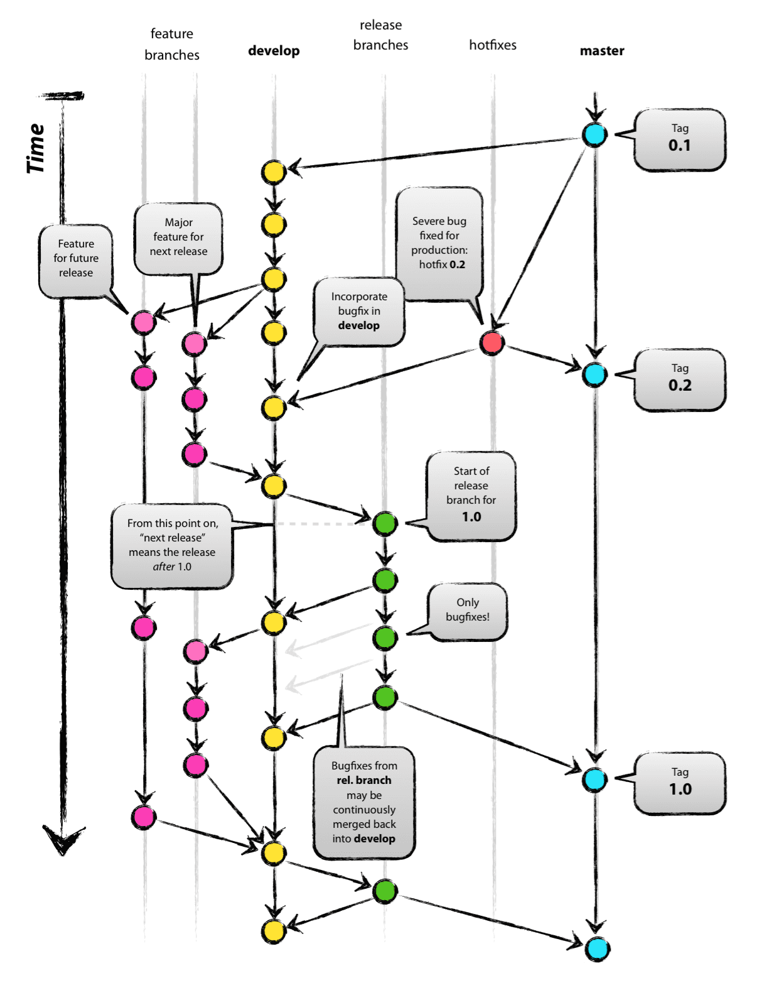
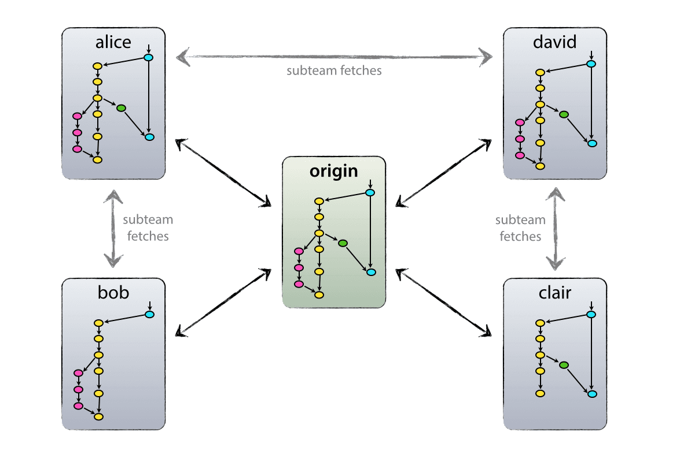
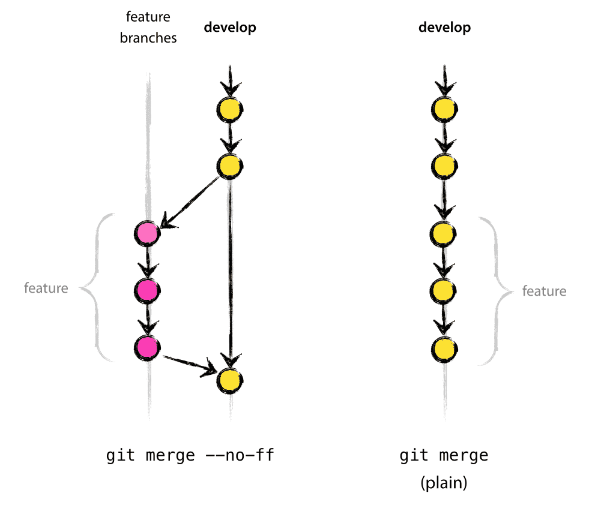

# A successful Git branching model

[Link](https://nvie.com/posts/a-successful-git-branching-model/)
<p align = "center">    </p>

## Why git? 

For a through discussion on the pros and cons of Git compared to centralized source code control system. Git really changed the way developers think of merging and branching. 

## Decentralized but centralized

The repository that we use and that works well with this branching model, is that with a central "true" repo. Note that this repo is only considered to be the central one. We will refer to this repos as `origin`. 
<p align = "center">    </p>

Each developer pulls and pushes to origin. But besides the centralized push-pull relationships, each developer may also pull changes from other peers to from sub teams. For example, this might be useful to work together with two ore more developers on a big new feature, before pushing the work in progress to `origin` prematurely. 


## The main branches

At the core, the development model is greatly inspired by existing models out there. The central repo holds to main branches with a infinite lifetime: 

- master
- develop

The `master` branch at `origin` should be familiar. Parallel to the `master` branch, another branch exists called `develop`. 
<p align = "center">    </p>

We consider `origin/master` to be the main branch where the source code of **HEAD** always reflects a _production-ready_ state. 
We consider `origin/develop` to be the main branch where the source code he **HEAD** always reflects a state with the latest delivered development changes for the next release. Some would call this the "integration branch". This is where any automatic nightly builds are built from. 

When the source code in the `develop` branch reaches a stable point and is ready to be released, all of the changes should be merged back into `master` somehow and then tagged with a release number. 

Therefore, each time when changes are merged back into `master`, this is a new production release by _definition_. We tend to be strict at this, so that theoretically, we could use a Git hook script to automatically build and roll-out our software to our production server every time there was a commit on `master`. 

## Supporting branches

Next to the main branches `master` and `develop`, our development model uses a variety of supporting branches to aid parallel development between team members, ease tracking of features, prepare for production releases and to assist in quickly fixing live production problems. Unlike the main branches, these branches always have a limited life time, since they will be removed eventually. 
The different types of branches we may use are: 
1. Feature branches
2. Release branches
3. Hotfix branches

Each of these branches have a specific purpose and are bound to strict rules as to which branches may be their originating branch and which must be their merge targets. 

### Feature branches
May brach off from: 
`develop`
Must merge back into: 
`develop`
Brach naming convention: 
anything except **master** **develop** 

Feature branches (or sometimes called topic branches) are used to develop new features for the upcoming or a distant future release. When starting development of a feature, the target release in which this feature will be incorporated may well be unknown at that point. The essence of a feature branch is that it exists as long as the feature is in development, but will eventually be merged back into `develop` or discarded.

Feature branches typically exist in developer repos only, not in `origin`. 
#### Create a feature branch

```bash
$ git checkout -b myfeature develop
Switched to a new branch "myfeature"
```

#### Incorporating a finished feature on develop

Finished features may merged into the `develop` branch to definitely add them to the upcoming release: 

```bash
$ git checkout develop
Switched to brach `develop`
$ git merge --no-ff myfeature
Updating ea1b82a..05e9557
(Summary of changes)
$ git branch -d myfeature
Deleted branch myfeature (was 05e9557).
$ git push origin develop
```

the `--no-ff` flag causes the merge to always create a new commit object, even if the merge could be performed with a fast-forward. this avoids losing information about the historical existence of a feature branch and groups together all commits that together added the feature. 
<p align = "center">    </p>

In the latter case, it is impossible to see from the Git history which of the commit objects together have implemented feature, you would have to manually read all the log messages. Reverting a whole feature , whereas it is easily done if the --no-ff flag was used. 
Yes, it will create a few more (empty) commit objects, but the gain is much bigger than the cost. 

### Release branches

May branch off from:
`develop`
Must merge back into:
`develop` and `master`
Branch naming convention:
`release-*`

Release branches support preparation of a new production release. They allow for last minutes dotting of i's ad crossing t's. Furthermore, they allow for minor bug fixes and preparing meta-data for a release. By doing all of this working on a release branch , the `develop` branch is cleared to receive features for the next big release. 

#### Creating a release branch

Release branches are created from the `develop` branch. 

```bash
$ git checkout -b release-1.2 develop
Switched to a new branch "release-1.2"
$ ./bump-version.sh 1.2
Files modified successfully, version bumped to 1.2.
$ git commit -a -m "Bumped version number to 1.2"
[release-1.2 74d9424] Bumped version number to 1.2
1 files changed, 1 insertions(+), 1 deletions(-)
```
Here, bump-version.sh is a fictional shell script that changes some files in the working copy to reflect the new version. (This can of course be a manual change—the point being that some files change.) Then, the bumped version number is committed.


#### Finishing a release branch

When the state of the release branch is ready to become a real release, some actions need to be carried out.First, the release branch is merged into master (since every commit on master is a new release by definition, remember). Next, that commit on master must be tagged for easy future reference to this historical version. Finally, the changes made on the release branch need to be merged back into develop, so that future releases also contain these bug fixes.

The first two steps in Git: 
```bash
$ git checkout master
Switched to branch 'master'
$ git merge --no-ff release-1.2
Merge made by recursive.
(Summary of changes)
$ git tag -a 1.2
```

To keep the changes made in the release branch, we need to merge those back into `develop`. 

```bash
$ git checkout develop
Switched to branch 'develop'
$ git merge --no-ff release-1.2
Merge made by recursive.
(Summary of changes)
```
This step may well lead to a merge conflict. If so, fix it and commit. 

remove the release branch
```bash
$ git branch -d release-1.2
Deleted branch release-1.2 (was ff452fe).
```

### Hotfix branches
May branch off from:
`master`
Must merge back into:
`develop` and `master`
Branch naming convention:
`hotfix-*`
Hotfix branches are very much like release branches in that they are also meant to prepare for a new production release, albeit unplanned. They arise from the necessity to act immediately upon an undesired state of a live production version. When a critical bug in a production version must be resolved immediately, a hotfix branch may be branched off from the corresponding tag on the master branch that marks the production version.

#### Creating the hotfix branch 

```bash
$ git checkout -b hotfix-1.2.1 master
Switched to a new branch "hotfix-1.2.1"
$ ./bump-version.sh 1.2.1
Files modified successfully, version bumped to 1.2.1.
$ git commit -a -m "Bumped version number to 1.2.1"
[hotfix-1.2.1 41e61bb] Bumped version number to 1.2.1
1 files changed, 1 insertions(+), 1 deletions(-)
```

Then, fix the bug and commit the fix in one or more separate commits. 

```bash
$ git commit -m "Fixed severe production problem"
[hotfix-1.2.1 abbe5d6] Fixed severe production problem
5 files changed, 32 insertions(+), 17 deletions(-)
```

#### Finishing a hotfix brach

When finished, the bugfix needs to be merged back into master, but also needs to be merged back into develop, in order to safeguard that the bugfix is included in the next release as well. This is completely similar to how release branches are finished.

First, update `master` and `tag` the release

```bash
$ git checkout master
Switched to branch 'master'
$ git merge --no-ff hotfix-1.2.1
Merge made by recursive.
(Summary of changes)
$ git tag -a 1.2.1
```

Next, include the bugfix in `develop` too: 

```
$ git checkout develop
Switched to branch 'develop'
$ git merge --no-ff hotfix-1.2.1
Merge made by recursive.
(Summary of changes)
```

The one exception to the rule here is that, **when a relase branch currently exits, the hotfix changes need to be merged into that release branch, instead of `develop`**. Backmerging the bugfix into the release branch will eventually result in the bugfix being merged into develop too, when the release branch is finished.
---