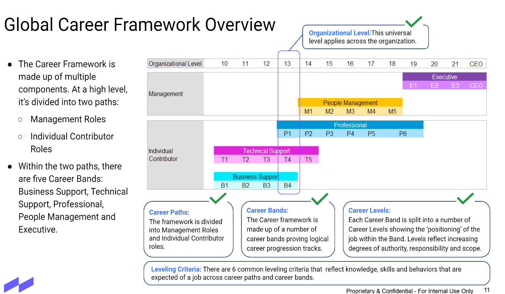

# Career Pathways

- [Career Pathways](#career-pathways)
  - [General](#general)
    - [Ownership and Scope](#ownership-and-scope)
    - [Teamwork and Collaboration](#teamwork-and-collaboration)
  - [Senior Software Engineer](#senior-software-engineer)
    - [Ownership and Scope](#ownership-and-scope-1)

## General

### Ownership and Scope
Takes responsibility for outcomes and doesn't make excuses.
**Deliver Impact** : Focuses on delivering the largest impact. 
**Identifies and fill gaps** : Finds gaps that fall between teams and actively files in those gaps. 
**Dive Deep** : Operates at all levels, stays connected to the details, audits frequently, and is skeptical with metrics and anecdote differ.  
**Inspire** : Starts with a big compelling vision and works backwards. 

### Teamwork and Collaboration
Ability to work well with teams while growing and living our culture/values to achieve business objectives.
**Be a Multiplier** : Recognizes, develops, and coaches exceptional talent. 
**Disagree & Commit** : Respectfully challenges decisions when you disagree. Once a decision is determined, commits wholly. 
**Build Trust** : Listens attentively, sp

## Senior Software Engineer

### Ownership and Scope
Helps define road map and architecture based on technology and business need. Tech

    

Individual Contributor. 
P1 P2 **P3** P4, P5, P6. 
Sr Engineer. Principal Engineer, Sr Principal Engineer, Fellow. 

Leveling Criteria: 
Six leveling criteria below.

1. Impact : 

- Focus on the job requirements and the nature of the work
  - What is expected of an incumbent who is fully 

Majority of time is spent on: 
1. 