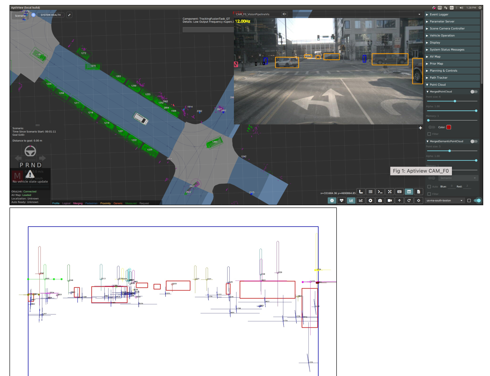
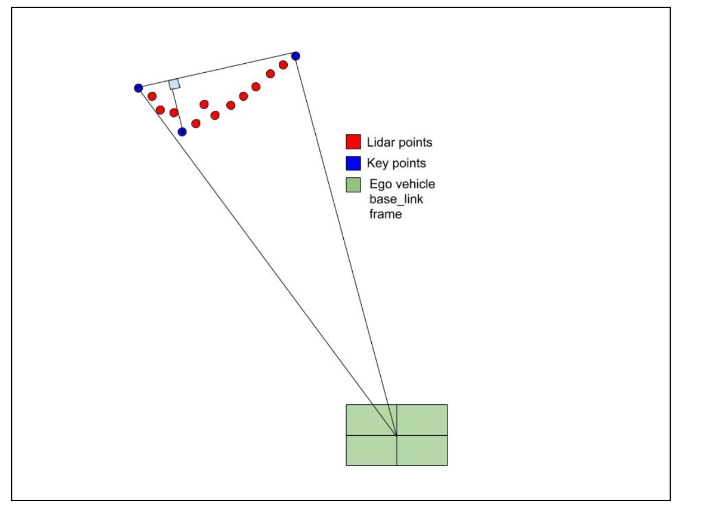

1. Vision Data Association
=======
2021-10-01

[link](https://confluence.ci.motional.com/confluence/pages/viewpage.action?spaceKey=PER&title=Vision+Data+Association)
- [1. Vision Data Association](#1-vision-data-association)
- [2. Background](#2-background)
  - [2.1. Choice of points for track/Lidar projection](#21-choice-of-points-for-tracklidar-projection)
    - [2.1.1. Key points](#211-key-points)
      - [2.1.1.1. Lidar key points](#2111-lidar-key-points)
      - [2.1.1.2. Track KeyPoints (not sure what is this)](#2112-track-keypoints-not-sure-what-is-this)
  - [2.2. Deputy Point](#22-deputy-point)
    - [2.2.1. Lidar Deputy Point](#221-lidar-deputy-point)
    - [2.2.2. Track Deputy Point](#222-track-deputy-point)

# 2. Background

For the vision data association there is a position, size, height and map prior score. 
1. to calculate these scores we project the **tracks** and **lidar measurements** (most recent measurement associated to each tack) into the image that is the current measurement and calculate scores using the detections (from ISN in the image) and the track/lidar projection for each track. 
2. The general idea is that the ISN detections are sampled from Gaussian that is centered on the projection_mean that is obtained from track/lidar projection. 
3. From lidar projection the real transform is used to project into the camera. 
4. For track projection we make the plane assumption since we do not estimate the height of tracks. Some characterization of the error coming from the aforementioned assumption is given here : [Evaluation tool for ISN - track association and potential routes](https://confluence.ci.motional.com/confluence/pages/viewpage.action?spaceKey=PER&title=Vision+Data+Association)

A debug image that illustrates the projection of track and lidar into the image is shown : 

    

## 2.1. Choice of points for track/Lidar projection
Currently points that are projected for each lidar measurements are: 
1. 3 **Key Points** computed for each cluster within the lidar pipeline. 
2. A **deputy point** that is obtained using 1 and **height of the cluster** computed in lidar pipeline. 

### 2.1.1. Key points
#### 2.1.1.1. Lidar key points
The algorithm to generate lidar key points is as follows. 
1. Sort the points by azimuth in the base_link frame. 
2. Take the leftmost point and rightmost point. 
3. Join the two points in 3 using a straight line. 
4. Select the 3rd key point called the "corner" as the cluster point furthest from this line in the direction facing the car. 
5. Amend the height of all 3 key points to the height of the height of the highest point in the cluster before the intensity filter is applied. 

    

#### 2.1.1.2. Track KeyPoints (not sure what is this)
For the track key points we pass the box that is the footprint of the track(4 key points). 

## 2.2. Deputy Point
### 2.2.1. Lidar Deputy Point
1. For the lidar measurement the deputy is a point that is the average of the rightmost and leftmost key points. 
2. If this point lies behind the camera center then the furthest key point from the camera center is selected. 
3. If this is still behind the camera center then projection fails. 

### 2.2.2. Track Deputy Point

