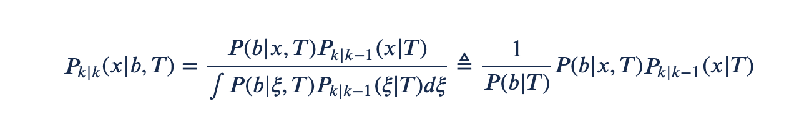

# They are tracklets, not detections

- [They are tracklets, not detections](#they-are-tracklets-not-detections)
  - [Motivation](#motivation)
  - [Comparison: Filtering with position detections](#comparison-filtering-with-position-detections)
  - [Tracklets](#tracklets)
  - [Single sensor : tracklet stitching](#single-sensor--tracklet-stitching)
    - [Data Partition problem](#data-partition-problem)
    - [Single sensor, path cover problem](#single-sensor-path-cover-problem)
  - [TODO list](#todo-list)

## Motivation

The framework for tracking with pure detections is to recursively apply Bayes's formula, with the prior coming from the previous iteration, and the likelihood coming from the sensor. Since in our system the tracker is not dealing directly with raw sensor measurements (lidar points and image pixels), we can think of LSN and ISN as virtual sensors. This prompted us to ask for the sensors' likelihood models, as described in [LSN Virtual Sensor Characteristics -- obsolete](https://confluence.ci.motional.com/confluence/display/PER/LSN+virtual+sensor+characteristics+--+Obsolete). In a discussion meeting, *** pointed our that doing so would lose a lot of information from the trained networks, see the motivation section on this [page](https://confluence.ci.motional.com/confluence/x/Xl46Bw). 

Then I tried to find out what fusing probabilities, not likelihoods, would mean for tracking. How is different from fusing two tracks? This led to a change of perspective on the nature of LSN/ISN "detections". The implication of the new perspective is also in line with the stated belief "we will be stitchers"

## Comparison: Filtering with position detections

To clarify this issue, let us start by an example where filtering is done with a constant velocity motion model but only position detections. Since tracking has to solve the data association problem and filtering problem jointly, let us condition everything on the ***T*** of a track, to remind ourselves that this is the be done for each track (inside a gated region). let *z* be a raw measurement under consideration. For simplicity let us consider only point targets, and assume that a virtual sensor has extracted from *z* the position measurement *b*. 
- *z* is lidar points 
- *b* is center of bounding box. 

Let a target state *x* consist of only position and velocity. From its distribution (or density) at the previous time  $P_{k-1|k-1}(x|T)$, we apply our motion model, say Near Constant Velocity (NCV) model, to get the predicted distribution $P_{k|k-1}(x|T)$. 

The sensor likelihood model for the position measurement provides the distribution $P(b| x, t)$, which means that, if the measurement cones from a track **T** sitting a position $x_{pos}$, how likely is the measurement error to be $b - x_{pos}$? 
With this, we can apply Bayes' formula to get the posterior distribution. 

    

The association likelihood $P(b|T)$ is what we will use to help solve the measurement assignment problem. 

There are two take-away from this section: 
1. The position measurement *b* is only part of the state. To get the full state, we need the help of filtering with data from the past. 
2. This is just a simplified way of using the information contained in the raw measurement. In other words, *b* is not the full story, *z* is. 

## Tracklets

A tracklet is a short sequence of measurements deemed by the sensor to have originated from the same target, and filtered by the sensor to reasonable degree of accuracy, (i.e., small enough covariance). A typical example is with an air-bone sensor looking down at tree lined streets, seeing each target only briefly before they disappear under the trees and reappear from the other side. Usually a downstream tracker/fuser is tasked with figuring out which one goes where, through "Stitching". 

A tracklet may contain within its data structure all the source measurements, or several full state estimates at different times. Even though our LSN/ISN output has only one time stamp, they are more like tracklets than single time detections for the following reasons: 
1. They are the result of processing buffered input frames instead of an instantaneous frames, and they contain the full state information as far as prediction with NCV model is concerned. 
2. They provide the posterior information, notionally denoted by $P(x, T | z)$. Conceptually we can think of it as "based on the lidar points, a pedestrian is standing next to the stop sign, with some uncertainty." This is different from a likelihood model, witch would say "if a pedestrian coming out pf a store is the source of the lidar cluster, how likely is the lidar cluster 2 meters away from the truth?"
3. The posterior can be thought of as the result of prior plus lidar detection likelihood. It is not easy to extract the later. More importantly, trained neural network usually contains very *rich* prior information should not be lost in the downstream tracker. 

Viewing them as tracklets changes the task of the tracker/fuser, which will be discussed in the next few sections. 

## Single sensor : tracklet stitching

Before we state the tracklet stitching problem, it may be helpful to review a hierarchy of problem formulations. 

### Data Partition problem
If we receive a set of identity-less outputs from a group of sensors, then the task of the fuser it to obtain a disjoint partition of the data, such that each partition contains only data coming from the same physical target, i.e., a partition is a track, except for a special partition that only collects clutter. Data items within a partition may have time overlap because they come from different sensors. Notionally we can solve the partition problem first, and then obtain the track state at different times through filtering/smoothing. Of course any practical solution would have to involve solving the two problems jointly. 

We can create a graph with nodes being the data items. If we set up dating thresholds to define how far apart in time and/or space can two nodes be if they are still considered coming from the same target. Then we can create edges that denote "can associate." It is non-trivial to assign association weights to the edges because of the different time overlapping patterns between sensors. 

### Single sensor, path cover problem

## TODO list
1. [LSN Virtual Sensor Characteristics -- obsolete](https://confluence.ci.motional.com/confluence/display/PER/LSN+virtual+sensor+characteristics+--+Obsolete)
2. Measurement [Likelihood Model](https://confluence.ci.motional.com/confluence/x/Xl46Bw)
